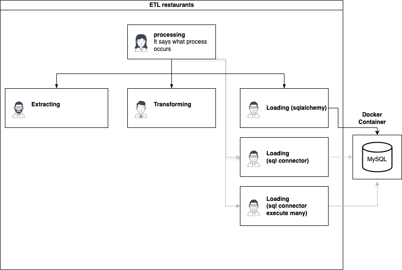

# ETL - Restaurantes

Este proyecto se centra en la Extracción, Transformación y Carga (ETL) de datos de restaurantes. Es la segunda asignación de Ingeniería de Datos en InTechMom.

## Instrucciones

La idea fue dividir el proyecto en los diferentes procesos que lo conforman



Para ejecutar con éxito el proceso de ETL, sigue estos pasos:

1. **Configurar el Entorno Virtual:**
   Asegúrate de haber creado un entorno virtual para este proyecto para gestionar las dependencias. Puedes hacer esto utilizando herramientas como **virtualenv**.

   Ejemplo en Mac o Linux, para windows es diferente, te recomiendo este [tutorial real python](https://realpython.com/python-virtual-environments-a-primer/)

   ```bash
   Python3 venv .venv
   source .venv/bin/activate
   ```
   e instalar las librerias necesarias.
   ```bash
   pip install -r requirements.txt
   ```

2. **Preparar la Estructura de Directorios:**
   Asegúrate de tener la estructura de directorios configurada al mismo nivel que tu proyecto. Coloca el archivo CSV requerido que contiene los datos de los restaurantes en este directorio.

   ```
   etl-restaurantes/
   data/
    ├── michelin_my_maps.csv
   ```

3. **Crear la Base de Datos con Docker:**
   Utiliza Docker para configurar tu entorno de base de datos. Si no tienes Docker instalado, puedes descargarlo e instalarlo desde el [sitio web oficial de Docker](https://www.docker.com/get-started).

    ```bash
    docker run --name <nombre_del_contenedor> -d \
    -p 3306:3306 \
    -e MYSQL_ROOT_PASSWORD=<tu_super_password> \
    -v mysql:/var/lib/mysql \
    mysql
    ```


4. **Actualizar las Credenciales de la Base de Datos:**
   Modifica el archivo `restaurants/loading.py` con las credenciales de tu base de datos. Asegúrate de que los detalles de la conexión coincidan con la configuración de tu base de datos.

5. **Ejecutar el Script de Procesamiento:**
   Este proyecto tiene la siguiente estructura.
   ```bash
    etl-restaurantes/
    ├── data_cleaned/
    ├── ods/
    ├── restaurants_ext/
    │   ├── __init__.py
    │   └── extracting.py
    ├── restaurants_load/
    │   ├── __init__.py
    │   └── loading.py
    ├── restaurants_tra/
    │   ├── __init__.py
    │   └── transforming.py
    ├── .gitignore
    ├── processing.py
    ├── README.md
    ├── requirements.txt

    ```

   Ejecuta el script de procesamiento `processing.py` para iniciar el proceso de ETL. Este script extraerá datos del archivo CSV, los transformará según sea necesario y los cargará en tu base de datos.

   ```bash
   python procesing.py
   ```

## Notas Adicionales

- Asegúrate de que tu base de datos esté en funcionamiento antes de ejecutar el script de procesamiento.
- Revisa los comentarios del código y la documentación dentro del directorio `restaurants` para obtener más detalles sobre cada paso del proceso de ETL.


Happy ETL-ing!
